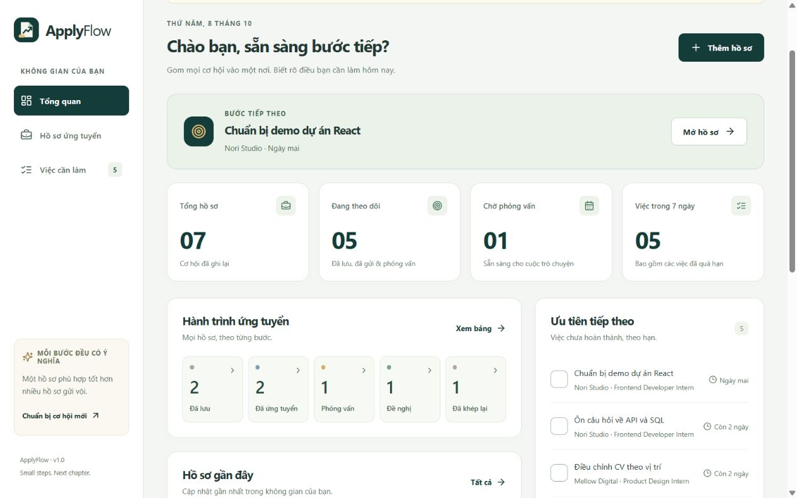
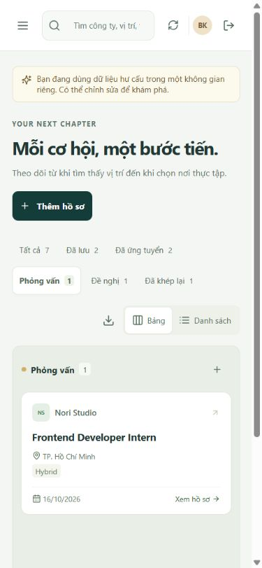

# ApplyFlow


A full-stack internship application tracker for students. Keep opportunities, interview preparation and follow-up tasks in one personal workspace.

The interface is in Vietnamese. Sample companies, vacancies and account identities are fictional. This is a portfolio project with working persistence and server-side access control, not a job board or a notification service.

## What you can do

- Register or sign in, or explore an isolated demo workspace without a shared password.
- Create, edit, search and filter applications across Saved, Applied, Interview, Offer and Closed stages.
- Switch between a board and a table; open each application to manage notes, dates and preparation tasks.
- Complete or delete tasks and view recent application activity.
- Export the currently filtered application list to a UTF-8 CSV with spreadsheet formula protection.
- Use the interface on a phone, navigate dialogs by keyboard and choose reduced motion through your system preference.

The date summaries show upcoming and overdue work inside the app. They do not send email or background reminders.

## Run locally

Requirements: **Node.js 24.0 or newer** and npm. The API uses Node's built-in `node:sqlite`, so an older Node runtime will not work. SQLite may display an experimental API warning on some Node 24 releases.

```sh
npm ci
cp .env.example .env
npm run dev
```

In PowerShell, use `Copy-Item .env.example .env` instead of `cp` if preferred. Open **http://127.0.0.1:5173**. Vite forwards `/api` to the Express API on port 3001. The API also accepts the equivalent `localhost` origin in development.

Click **Dùng thử với dữ liệu mẫu** to create a private demo containing seven fictional applications and five tasks. Registration creates an empty workspace. There is no default administrator or real credential in the repository.

Data persists in `data/applyflow.sqlite`; the containing directory is created automatically. Restarting the server preserves registered accounts and application data. Keep this file private and back it up before changing the schema.

## Check and build

```sh
npm run check
npm run format:check
```

`check` runs TypeScript checks, API behavior tests and a Vite/TypeScript production build. Tests use isolated memory databases, apart from one temporary persistence test. They cover authentication, session rotation and expiry, CSRF/Origin rejection, owner isolation, owned CRUD/tasks, stale versions, validation, transaction rollback, secure production headers, CSV escaping and runtime configuration.

```sh
npm run build
npm start
```

The compiled Express server serves both `/api` and `dist/client`. Run it from the project root. Configure the matching origin before opening this single-server build; the development `.env` assumes Vite on port 5173.

For a **local-only compiled production preview**, set these environment variables before `npm start`:

```text
NODE_ENV=production
APP_ORIGIN=http://127.0.0.1:18101
PORT=18101
HOST=127.0.0.1
ALLOW_INSECURE_LOCAL_HTTP=true
ENABLE_DEMO=true
```

Open http://127.0.0.1:18101. This explicit preview keeps CSP and other security headers, permits an HTTP cookie on loopback, and disables automatic HTTPS upgrades for that local HTTP preview. It refuses a public origin or a non-loopback bind. **Real deployments must use HTTPS and leave `ALLOW_INSECURE_LOCAL_HTTP=false`.**

## Architecture

| Layer              | Purpose                                                          |
| ------------------ | ---------------------------------------------------------------- |
| React + TypeScript | Views, forms, accessible dialogs and local display filters       |
| Vite               | Development proxy and static production assets                   |
| Express 5 + Zod    | JSON routes, request validation, authentication and owner checks |
| SQLite via Node 24 | Persistent users, sessions, applications, tasks and activity     |
| `shared/types.ts`  | Client/server domain types and stage labels                      |

Applications and tasks are always scoped through the authenticated owner in the API. Prepared SQL statements bind data separately from queries. Application updates carry a version number: a stale tab receives a conflict instead of overwriting newer changes. Related writes use transactions; deleting an application cascades its tasks and retains the owner's activity entry.

Passwords use salted scrypt hashes. The browser holds a random HttpOnly, SameSite=Lax session cookie; only a SHA-256 digest of its token is stored in SQLite. Login and registration rotate sessions. Every state-changing route checks both the exact allowed Origin and a session-bound CSRF token. Production cookies are Secure. Helmet supplies browser security headers, and request/authentication rate limits run in memory.

See [architecture and API notes](docs/ARCHITECTURE.md), [deployment and data care](docs/DEPLOYMENT.md) and [a short Vietnamese demo guide](docs/DEMO_GUIDE.vi.md).

## Configuration

| Variable                    | Default                   | Meaning                                                                   |
| --------------------------- | ------------------------- | ------------------------------------------------------------------------- |
| `NODE_ENV`                  | development               | `production` enables CSP and HTTPS requirements                           |
| `APP_ORIGIN`                | `http://localhost:5173`   | Exact browser origin, without a path or trailing slash                    |
| `HOST`                      | `127.0.0.1`               | Interface to bind; use `0.0.0.0` only when deployment networking needs it |
| `PORT`                      | `3001`                    | API/compiled server port                                                  |
| `DATABASE_PATH`             | `./data/applyflow.sqlite` | Private persistent SQLite file                                            |
| `ENABLE_DEMO`               | false unless set          | Enable creation of isolated fictional demo accounts                       |
| `TRUST_PROXY`               | `0`                       | Use `1` only behind exactly one trusted reverse proxy                     |
| `ALLOW_INSECURE_LOCAL_HTTP` | false                     | Explicit loopback-only production preview                                 |

To remove demo accounts created more than seven days ago:

```sh
npm run prune:demo
```

Their associated data and sessions cascade away. Registered accounts are excluded. This is an explicit maintenance command, not an automatic retention promise; schedule it if you enable a public demo.

## Scope and limits

- Single Node process with SQLite on persistent local storage; this is not a multi-region or multi-instance deployment design.
- No email verification, password recovery, social login, file uploads, email alerts or recruiting integrations.
- A registered account is capped at 500 applications and each application at 100 tasks. Limits also apply to demo users.
- Cookie sessions expire after seven days. Guest CSRF sessions expire after one hour. Rate-limit counters reset when the server restarts.
- Activity displays the latest 50 entries and records application changes plus task creation; it is not a complete security audit log.
- Schema initialization is version 1. There is no general migration framework yet; review and back up existing data before a future schema change.
- CSV export covers applications currently displayed, not a complete account backup. Dates have calendar-day precision.
- UI/browser review is separate from API tests. CI does not run browser automation.

## Project ownership and license

Built as a student portfolio project with AI-assisted development. Read the code, run the demo and explain the tradeoffs before presenting it as your work. No employment history, user count or effectiveness claim is implied.

Original application code and the SVG logo are under the [MIT License](LICENSE). Dependencies retain their respective licenses. The document-and-arrow logo represents keeping an application and its next step together. The interface uses CSS and Lucide icons; no externally hosted photographs or paid assets are required.

## Screenshots

Captured from the compiled local application with fictional demo data after the October 2026 workspace and logo update.




