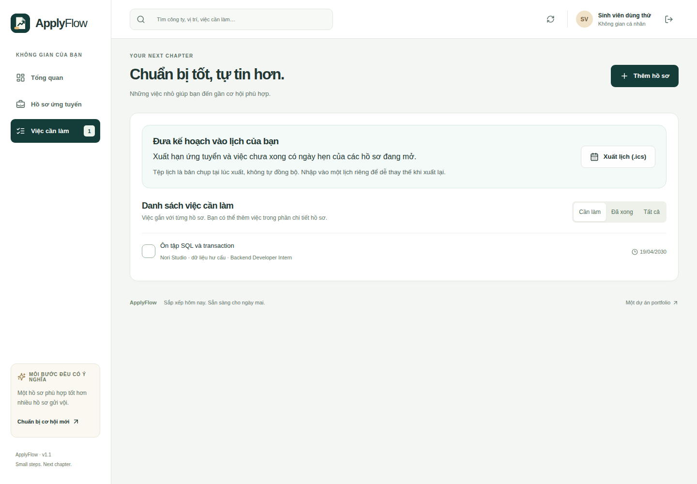
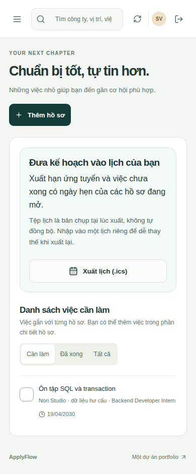
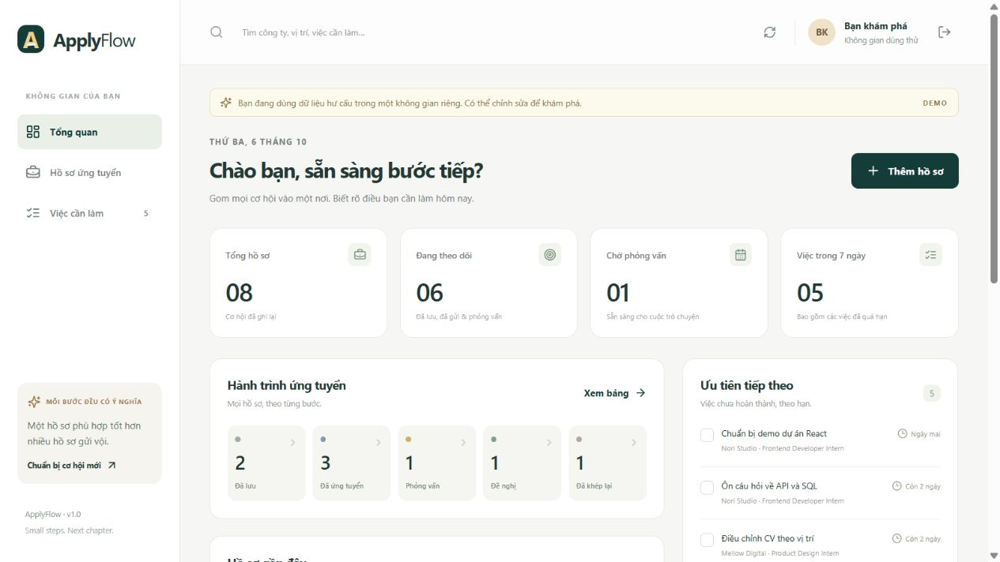
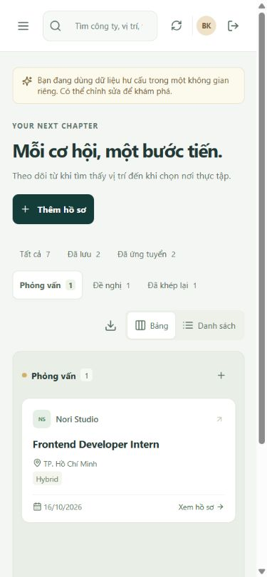

# ApplyFlow


Ứng dụng theo dõi hồ sơ thực tập và việc cần chuẩn bị cho mỗi lần ứng tuyển.
Giao diện tiếng Việt, dùng React, TypeScript, Express và SQLite.

## Chức năng

- Lưu công ty, vị trí, hạn ứng tuyển, ghi chú và trạng thái hồ sơ.
- Theo dõi hồ sơ ở dạng bảng hoặc các cột Saved, Applied, Interview, Offer và Closed.
- Tạo việc cần làm cho từng hồ sơ, đánh dấu hoàn thành và xem lịch sử thay đổi.
- Tìm kiếm, lọc và xuất danh sách đang xem ra CSV.
- Xuất hạn ứng tuyển và việc cần làm thành tệp lịch `.ics`, nhập vào Google Calendar, Outlook hoặc Apple Calendar.
- Đăng ký tài khoản riêng hoặc mở một không gian dùng thử với dữ liệu mẫu.

## Chạy ở máy cá nhân

Cần Node.js 24 trở lên vì backend dùng module `node:sqlite`.

```bash
npm ci
cp .env.example .env
npm run dev
```

Trên PowerShell, thay lệnh sao chép bằng `Copy-Item .env.example .env`.
Mở http://127.0.0.1:5173. Vite chuyển các yêu cầu `/api` đến backend ở cổng 3001.

Nút **Dùng thử với dữ liệu mẫu** tạo một không gian riêng, gồm các hồ sơ và công ty hư cấu.
Tài khoản đăng ký mới bắt đầu với danh sách trống.
Dữ liệu được lưu ở `data/applyflow.sqlite` và còn lại sau khi khởi động lại ứng dụng.

## Kiểm tra và build

```bash
npm run check
npm run format:check
```

`check` chạy kiểm tra TypeScript, kiểm thử API và build. Để chạy bản đã biên dịch:

```bash
npm run build
npm start
```

Khi chạy trực tiếp ở cổng 3001, đặt `APP_ORIGIN=http://127.0.0.1:3001` trong `.env`.
Cấu hình HTTPS, cookie và lưu trữ khi đưa lên host được ghi trong [hướng dẫn triển khai](docs/deployment.md).

## Xuất lịch và chạy bằng Docker

Trong **Việc cần làm**, bấm **Xuất lịch (.ics)**. Lịch chứa hạn ứng tuyển và việc chưa hoàn thành
có ngày hẹn của các hồ sơ chưa đóng. Sự kiện cả ngày giữ nguyên ngày khi thay đổi múi giờ.
Ghi chú riêng của hồ sơ không được đưa vào tệp lịch.

Đây là tệp xuất tại một thời điểm, chưa có đồng bộ hai chiều. Khi hoàn thành việc, đổi hạn hoặc
đóng hồ sơ, hãy xuất lại. Nên nhập vào một lịch riêng và thay lịch cũ để tránh giữ sự kiện đã bỏ.
UID của cùng bản ghi được giữ ổn định; cách xử lý tệp nhập trùng tùy phần mềm lịch.

```bash
docker compose up --build -d
```

Mở http://127.0.0.1:3001. Cấu hình Compose này dùng cho máy cá nhân, chỉ mở cổng ra loopback;
dữ liệu nằm trong volume `applyflow-data`. `docker compose down` giữ lại dữ liệu.
Docker image chạy bằng tài khoản `node`, có healthcheck và hỗ trợ cấu hình HTTPS khi triển khai thật.

Kiểm thử trình duyệt dùng bản build thật và SQLite riêng cho mỗi lần chạy:

```bash
npm run build
npx playwright install chromium
npm run test:browser
```

[GitHub Actions](https://github.com/nguyenhonggiang2407/ApplyFlow/actions/workflows/ci.yml)
chạy kiểm thử API, TypeScript, giao diện máy tính/điện thoại, Docker và kiểm tra dữ liệu sau khi
khởi động lại container. Ảnh mới được lưu trong artifact `applyflow-screenshots` của lần chạy.

## Cấu trúc

- `client/src/`: giao diện, biểu mẫu, bảng hồ sơ và việc cần làm.
- `server/src/`: API, xác thực, kiểm tra dữ liệu và truy vấn SQLite.
- `shared/types.ts`: kiểu dữ liệu và trạng thái dùng chung.
- `tests/`: kiểm thử API và xử lý yêu cầu từ client.

API kiểm tra chủ sở hữu của hồ sơ và công việc. Mật khẩu được băm bằng scrypt;
phiên đăng nhập dùng cookie HttpOnly và các thao tác ghi cần CSRF token.
Mỗi lần sửa hồ sơ có số phiên bản để phát hiện hai tab cùng sửa một bản ghi.

## Tài liệu

- [Kiến trúc và API](docs/architecture.md)
- [Cấu hình và triển khai](docs/deployment.md)
- [Cách dùng thử](docs/demo.md)

Ứng dụng hiện hiển thị hạn công việc trong trang, chưa gửi email nhắc việc.
Bản này chạy một tiến trình Node với SQLite trên ổ lưu trữ cố định.

## Lịch công việc



<details>
<summary>Giao diện lịch trên điện thoại</summary>



</details>

Bản nâng cấp vượt qua **25 kiểm thử API/logic và 3 kiểm thử trình duyệt**, cùng Docker và
kiểm tra dữ liệu sau khi khởi động lại container. [Xem lần kiểm tra](https://github.com/nguyenhonggiang2407/ApplyFlow/actions/runs/41573666072).

## Hình ảnh





## Giấy phép

Mã ứng dụng và logo dùng [MIT License](LICENSE). Thư viện bên ngoài giữ giấy phép riêng.
