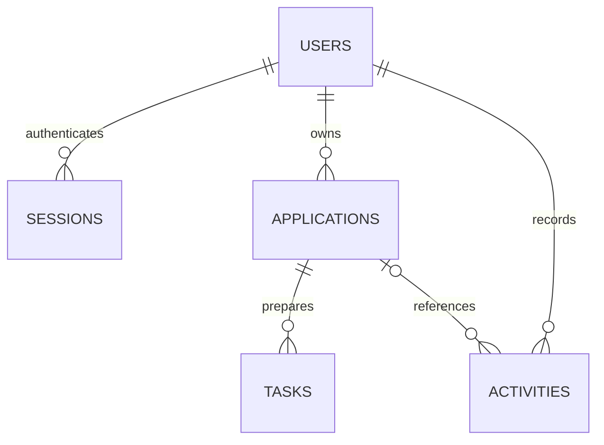

# Architecture and API notes

## Request path

The browser calls a same-origin `/api` URL. In development Vite proxies it to port 3001; the compiled Express process serves the same static client and API in production.

1. Helmet adds security headers and Express parses JSON with a 32 KB limit.
2. A cookie token is hashed and matched against an unexpired session. User responses omit the password hash.
3. A write must have the configured Origin and the CSRF token associated with that session.
4. Zod validates the body. Strict schemas reject unknown fields such as a supplied owner ID.
5. Owner predicates and prepared SQL statements enforce access and write data. Related writes use a synchronous transaction.
6. The client reloads the workspace after a write. An account epoch prevents an older workspace response from replacing another account's data.

The server sends API responses with `Cache-Control: no-store`. The client does not place credentials or application data in localStorage.

## Data model

- `users`: identity, password hash, demo flag and creation time.
- `sessions`: hashed cookie token, owner (nullable for guests), CSRF token and expiry.
- `applications`: owner, position metadata, five-stage status, calendar dates, notes and optimistic version.
- `tasks`: parent application, title, date and completion flag.
- `activities`: owner, optional parent application, display message and timestamp.

Foreign keys are enabled. SQLite uses WAL mode and a five-second busy timeout. Queries use the owner/status and task/application indexes. UTC ISO timestamps record events; form dates are `YYYY-MM-DD` calendar dates.

## Routes

| Method             | Path                           | Behavior                                                       |
| ------------------ | ------------------------------ | -------------------------------------------------------------- |
| GET                | `/api/health`                  | Database connectivity check                                    |
| GET                | `/api/auth/session`            | Current user and CSRF token; creates a guest session if needed |
| POST               | `/api/auth/register`           | Creates an empty workspace and rotates the session             |
| POST               | `/api/auth/login`              | Verifies a non-demo account and rotates the session            |
| POST               | `/api/auth/demo`               | Creates an isolated fictional workspace when enabled           |
| POST               | `/api/auth/logout`             | Deletes the active session and expires the cookie              |
| GET                | `/api/workspace`               | Owned applications/tasks and the latest 50 activity entries    |
| GET                | `/api/applications?q=&status=` | Literal text/status filtering of owned applications            |
| POST               | `/api/applications`            | Create an owned application                                    |
| GET / PUT / DELETE | `/api/applications/:id`        | Owned detail, version-checked update or delete                 |
| POST               | `/api/applications/:id/tasks`  | Create a task under an owned application                       |
| PATCH              | `/api/tasks/:id`               | Set an owned task's completion flag                            |
| DELETE             | `/api/tasks/:id`               | Delete an owned task                                           |

All POST, PUT, PATCH and DELETE requests, including authentication requests, require Origin and `X-CSRF-Token`. Fetch `/api/auth/session` first and retain the session cookie. A login response returns the replacement CSRF token; the previous token stops working.

Typical response codes are 400 for validation, 401 for missing/expired authentication, 403 for Origin/CSRF rejection, 404 for an absent or foreign resource, and 409 for stale versions or configured limits. Foreign IDs intentionally look absent.

## Design decisions to explain

- **SQLite:** small installation footprint and simple persistent local demo. It needs a persistent disk and does not meet arbitrary multi-instance scaling needs.
- **Server-backed cookies:** logout immediately invalidates a session; no client-stored bearer token. CSRF and Origin checks protect writes that browsers can send with cookies.
- **Optimistic versions:** two tabs can edit without silently losing the first update. A conflict asks the user to reload and reopen the form.
- **Isolated demo:** each visitor owns their sample data. Maintenance must prune abandoned demo accounts.
- **Explicit dates:** the app highlights deadlines inside the interface; it cannot promise an email reminder or a background notification.

## Test boundaries

The API tests make real HTTP requests to Express through Supertest and use the actual SQLite store and password implementation. They check denied writes leave data unchanged and owners retain access. They do not replace deployment TLS checks or manual keyboard/mobile browser review. No tests or docs claim a measured career or productivity outcome.
